# EcoSphere ESG Management Platform - Database Architecture

Welcome to the initial database commit for the **EcoSphere ESG (Environmental, Social, and Governance) Management Platform**. 

This document serves as the comprehensive design layout for the platform's PostgreSQL database schema, including the Entity Relationship (ER) Diagram, detailed relationship documentation, index recommendations, and critical architectural enforcement maps.

---

## 1. Complete Entity Relationship (ER) Diagram

Below is the complete database structure visualized using a Mermaid ER Diagram. It highlights all 29 entities, their key attributes, and relationship cardinalities.

```mermaid
erDiagram
    users {
        uuid id PK
        varchar email UK
        varchar password_hash
        user_role role
        varchar github_id
        boolean active
        timestamptz created_at
        timestamptz updated_at
    }

    departments {
        uuid id PK
        varchar name
        varchar code UK
        uuid head_id FK
        uuid parent_department_id FK
        char country_code
        int employee_count
        boolean active
        timestamptz created_at
        timestamptz updated_at
    }

    employees {
        uuid id PK
        uuid user_id FK, UK
        varchar name
        uuid department_id FK
        varchar gender
        date hire_date
        boolean active
        timestamptz created_at
        timestamptz updated_at
    }

    categories {
        uuid id PK
        varchar name
        category_type type
        boolean active
        timestamptz created_at
        timestamptz updated_at
    }

    products {
        uuid id PK
        varchar name
        varchar sku UK
        varchar default_unit
        boolean active
        timestamptz created_at
        timestamptz updated_at
    }

    product_esg_profiles {
        uuid id PK
        uuid product_id FK, UK
        decimal carbon_intensity
        varchar intensity_unit
        boolean recyclable
        boolean eco_certified
        text notes
        boolean active
        timestamptz created_at
        timestamptz updated_at
    }

    operation_records {
        uuid id PK
        operation_type type
        date record_date
        uuid department_id FK
        uuid product_id FK
        text description
        decimal quantity
        varchar unit
        decimal amount
        boolean active
        timestamptz created_at
        timestamptz updated_at
    }

    emission_factors {
        uuid id PK
        varchar activity_type
        varchar unit
        varchar region
        decimal factor_value
        emission_source source
        int valid_year
        varchar reference_url
        boolean active
        timestamptz created_at
        timestamptz updated_at
    }

    carbon_transactions {
        uuid id PK
        uuid operation_record_id FK
        uuid emission_factor_id FK
        decimal factor_value_snapshot
        decimal quantity
        varchar unit
        decimal calculated_emission
        uuid department_id FK
        date txn_date
        boolean auto_calculated
        boolean active
        timestamptz created_at
        timestamptz updated_at
    }

    sustainability_goals {
        uuid id PK
        varchar title
        uuid department_id FK
        goal_metric metric
        decimal baseline_value
        decimal target_value
        int period_year
        varchar status
        boolean active
        timestamptz created_at
        timestamptz updated_at
    }

    csr_activities {
        uuid id PK
        varchar title
        uuid category_id FK
        text description
        date activity_date
        int points_value
        boolean evidence_required
        boolean active
        timestamptz created_at
        timestamptz updated_at
    }

    employee_participations {
        uuid id PK
        uuid employee_id FK
        uuid csr_activity_id FK
        varchar proof_url
        approval_status approval_status
        int points_earned
        date completion_date
        boolean active
        timestamptz created_at
        timestamptz updated_at
    }

    diversity_metrics {
        uuid id PK
        uuid department_id FK
        varchar period
        int headcount
        int female_count
        int male_count
        int other_count
        decimal pay_gap_pct
        boolean active
        timestamptz created_at
        timestamptz updated_at
    }

    training_records {
        uuid id PK
        uuid employee_id FK
        varchar training_name
        varchar category
        timestamptz completed_at
        date due_date
        boolean active
        timestamptz created_at
        timestamptz updated_at
    }

    esg_policies {
        uuid id PK
        varchar title
        text description
        varchar document_url
        policy_category category
        varchar version
        policy_status status
        boolean active
        timestamptz created_at
        timestamptz updated_at
    }

    policy_acknowledgements {
        uuid id PK
        uuid policy_id FK
        uuid employee_id FK
        timestamptz acknowledged_at
        boolean active
        timestamptz created_at
        timestamptz updated_at
    }

    audits {
        uuid id PK
        varchar scope
        uuid auditor_id FK
        date audit_date
        audit_status status
        boolean active
        timestamptz created_at
        timestamptz updated_at
    }

    compliance_issues {
        uuid id PK
        uuid audit_id FK
        compliance_severity severity
        text description
        uuid owner_id FK
        date due_date
        compliance_status status
        boolean active
        timestamptz created_at
        timestamptz updated_at
    }

    xp_events {
        uuid id PK
        uuid employee_id FK
        int delta
        xp_source_type source
        uuid source_id
        varchar note
        timestamptz created_at
    }

    challenges {
        uuid id PK
        varchar title
        uuid category_id FK
        text description
        int xp_reward
        challenge_difficulty difficulty
        boolean evidence_required
        date deadline
        challenge_status status
        boolean active
        timestamptz created_at
        timestamptz updated_at
    }

    challenge_participations {
        uuid id PK
        uuid challenge_id FK
        uuid employee_id FK
        decimal progress
        varchar proof_url
        approval_status approval_status
        int xp_awarded
        boolean active
        timestamptz created_at
        timestamptz updated_at
    }

    badges {
        uuid id PK
        varchar name UK
        text description
        varchar icon
        jsonb unlock_rule
        boolean active
        timestamptz created_at
        timestamptz updated_at
    }

    employee_badges {
        uuid id PK
        uuid employee_id FK
        uuid badge_id FK
        timestamptz awarded_at
    }

    rewards {
        uuid id PK
        varchar name
        text description
        int points_required
        int stock
        reward_status status
        boolean active
        timestamptz created_at
        timestamptz updated_at
    }

    reward_redemptions {
        uuid id PK
        uuid reward_id FK
        uuid employee_id FK
        int points_deducted
        timestamptz redeemed_at
    }

    department_scores {
        uuid id PK
        uuid department_id FK
        date period_start
        date period_end
        decimal environmental_score
        decimal social_score
        decimal governance_score
        decimal total_score
        timestamptz computed_at
    }

    esg_configurations {
        uuid id PK
        decimal env_weight
        decimal social_weight
        decimal gov_weight
        boolean auto_emission_calc
        boolean evidence_required
        boolean badge_auto_award
        timestamptz updated_at
        uuid updated_by FK
    }

    notification_settings {
        uuid id PK
        uuid employee_id FK
        notification_event_type event_type
        boolean in_app
        boolean email
        timestamptz updated_at
    }

    notifications {
        uuid id PK
        uuid user_id FK
        notification_event_type event_type
        varchar title
        text body
        varchar related_table
        uuid related_id
        timestamptz read_at
        timestamptz created_at
    }

    users ||--o| employees : "has profile"
    departments ||--o{ employees : "contains members"
    employees ||--o{ departments : "heads"
    departments ||--o| departments : "parent"
    categories ||--o{ csr_activities : "classifies"
    categories ||--o{ challenges : "classifies"
    products ||--o| product_esg_profiles : "has profile"
    products ||--o{ operation_records : "referenced in"
    departments ||--o{ operation_records : "executes"
    emission_factors ||--o{ carbon_transactions : "calculates"
    operation_records ||--o{ carbon_transactions : "triggers"
    departments ||--o{ carbon_transactions : "allocated to"
    departments ||--o{ sustainability_goals : "targets"
    csr_activities ||--o{ employee_participations : "includes"
    employees ||--o{ employee_participations : "registers"
    departments ||--o{ diversity_metrics : "reports"
    employees ||--o{ training_records : "completes"
    esg_policies ||--o{ policy_acknowledgements : "requires"
    employees ||--o{ policy_acknowledgements : "signs"
    employees ||--o{ audits : "conducts"
    audits ||--o{ compliance_issues : "identifies"
    employees ||--o{ compliance_issues : "owns"
    employees ||--o{ xp_events : "earns/spends"
    challenges ||--o{ challenge_participations : "includes"
    employees ||--o{ challenge_participations : "undertakes"
    badges ||--o{ employee_badges : "awarded"
    employees ||--o{ employee_badges : "unlocks"
    rewards ||--o{ reward_redemptions : "redeemed"
    employees ||--o{ reward_redemptions : "buys"
    departments ||--o{ department_scores : "scores"
    users ||--o{ esg_configurations : "configures"
    employees ||--o{ notification_settings : "manages"
    users ||--o{ notifications : "receives"
```

---

## 2. Detailed Relationship Documentation

### Core Circular Reference: Employee & Department
*   **Problem**: A department contains many employees (`employees.department_id` references `departments.id`), but a department also lists an employee as its head (`departments.head_id` references `employees.id`).
*   **Resolution (PostgreSQL)**: The `departments` table is defined first with `head_id` as a nullable field without a constraint. After the `employees` table is successfully built, an `ALTER TABLE` statement is executed to apply the `FOREIGN KEY` constraint `fk_departments_head_id`.
*   **Resolution (Prisma)**: Expressed with two named relationships (`"DepartmentHead"` and `"DepartmentEmployees"`) so Prisma Client generates distinct accessors without conflict.

### Gamification & Accounting Ledger: Append-Only XP Loop
Instead of updating an integer column on a user profile (which creates write locks, race conditions, and is unauditable), EcoSphere utilizes an append-only ledger (`xp_events`).
*   **Earn Loop**: When a CSR participation or challenge completion is marked `Approved`, the system inserts a positive `delta` row referencing the trigger participation (`source_id`).
*   **Spend Loop**: When a reward is purchased, the system inserts a negative `delta` row in the same transaction as the stock decrement.
*   **Balance Queries**: The employee's total XP and points balances are calculated dynamically via `SUM(delta)`.

### Hierarchical Departments
*   Departments support tree-like structures using self-referential keys (`parent_department_id`). This permits rolling up carbon footprints, social participation rates, and compliance weights up the corporate hierarchy.

### Governance Audit & Compliance Assignments
*   Every compliance issue maps to an audit (`audit_id`) and must have a designated owner (`owner_id` FK to `employees`) and a deadline (`due_date`). If the issue status is `Open` and the date passes `due_date`, the system flags it as overdue, directly affecting the department's Governance score and dispatching warning alerts.

---

## 3. Index Recommendations

### Foreign Key Optimization Indexes
To maintain performance during cascading deletes and relational joins, index keys are added to all foreign key parameters:
1.  `idx_employees_department` on `employees(department_id)`
2.  `idx_operation_records_department` on `operation_records(department_id)`
3.  `idx_operation_records_product` on `operation_records(product_id)`
4.  `idx_carbon_transactions_op_rec` on `carbon_transactions(operation_record_id)`
5.  `idx_carbon_transactions_factor` on `carbon_transactions(emission_factor_id)`
6.  `idx_sustainability_goals_department` on `sustainability_goals(department_id)`
7.  `idx_csr_activities_category` on `csr_activities(category_id)`
8.  `idx_employee_participations_employee` on `employee_participations(employee_id)`
9.  `idx_employee_participations_activity` on `employee_participations(csr_activity_id)`
10. `idx_training_records_employee` on `training_records(employee_id)`
11. `idx_policy_acknowledgements_policy` on `policy_acknowledgements(policy_id)`
12. `idx_policy_acknowledgements_employee` on `policy_acknowledgements(employee_id)`
13. `idx_audits_auditor` on `audits(auditor_id)`
14. `idx_compliance_issues_audit` on `compliance_issues(audit_id)`
15. `idx_compliance_issues_owner` on `compliance_issues(owner_id)`
16. `idx_xp_events_employee` on `xp_events(employee_id)`
17. `idx_challenges_category` on `challenges(category_id)`
18. `idx_challenge_participations_challenge` on `challenge_participations(challenge_id)`
19. `idx_challenge_participations_employee` on `challenge_participations(employee_id)`
20. `idx_employee_badges_employee` on `employee_badges(employee_id)`
21. `idx_employee_badges_badge` on `employee_badges(badge_id)`
22. `idx_reward_redemptions_reward` on `reward_redemptions(reward_id)`
23. `idx_reward_redemptions_employee` on `reward_redemptions(employee_id)`
24. `idx_department_scores_department` on `department_scores(department_id)`
25. `idx_notification_settings_employee` on `notification_settings(employee_id)`
26. `idx_notifications_user` on `notifications(user_id)`

### Critical Performance Composite Indexes
For high-volume query components in the platform:
1.  **Emission Factor Resolution Pipeline**:
    *   **Index**: `idx_emission_factors_lookup_perf` on `emission_factors(activity_type, region, valid_year)`
    *   **Rationale**: Used constantly on new operational logs to resolve emission factors (e.g. matching specific regional activity types for a transaction year, before falling back to `GLOBAL` region).
2.  **Dashboard Dashboard Metrics**:
    *   **Index**: `idx_carbon_transactions_dept_date` on `carbon_transactions(department_id, txn_date)`
    *   **Rationale**: Carbon dashboards filter transactions by department and date range. A composite index satisfies both filters, avoiding costly sequential scans.
3.  **Partial Index for Notifications**:
    *   **Index**: `idx_notifications_unread` on `notifications(user_id) WHERE read_at IS NULL`
    *   **Rationale**: Employees check their unread notifications frequently. Indexing only unread messages keeps index sizes minuscule while speeding up loading the user inbox.

---

## 4. Business Rules & SQL-Level Constraints

| Mandatory Rule | Table/Field | Database Enforcement |
| :--- | :--- | :--- |
| **Weight Configurations** | `esg_configurations` | `CHECK (env_weight + social_weight + gov_weight = 1.00)` ensures weights sum exactly to 100%. |
| **Singleton Config** | `esg_configurations` | `CHECK (id = '00000000-0000-0000-0000-000000000000'::uuid)` guarantees that only one row can ever exist in this settings catalog. |
| **Double Redemption Gate** | `rewards` | `CHECK (stock >= 0)` blocks concurrent redemptions if the catalog stock count drops below zero. |
| **Evidence Validation** | `employee_participations` | Set as non-nullable URL check in software layer when `evidence_required` is enabled. |
| **XP Integrity** | `xp_events` | Append-only ledger format. Negative values permitted for redemptions; ledger queries prevent double-counting. |
| **Unique Participation** | `employee_participations`, `challenge_participations` | Unique keys `uq_employee_participation` and `uq_challenge_participation` block retry exploits. |
| **Auditable Emissions** | `carbon_transactions` | Saves `factor_value_snapshot` value to protect historic reports if the parent emission factor undergoes updates. |
| **Diversity Metric Alignment** | `diversity_metrics` | `CHECK (female_count + male_count + other_count = headcount)` validates demographic totals. |
| **Soft Delete** | Multiple Tables | `active BOOLEAN DEFAULT TRUE` marks rows as inactive, hiding them from dashboards without removing historical logs. |
